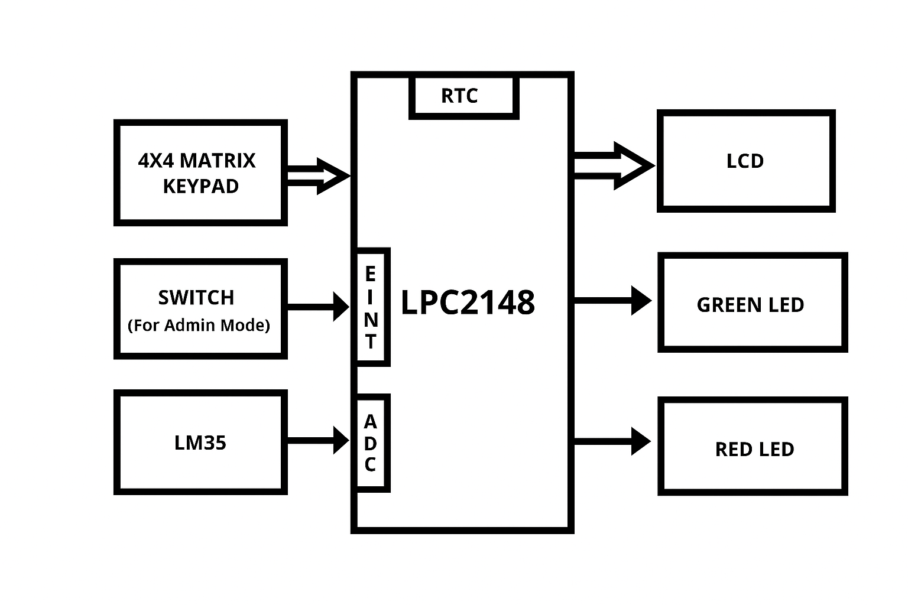

# EventBoard - RTC-Driven Message Display System  

## 📌 Overview  
The **EventBoard** is a real-time automated message display system built using the **LPC2148 ARM7 microcontroller**. It displays **predefined scrolling messages** on a 16x2 LCD at specific times using the **on-chip RTC (Real-Time Clock)**.  

The system includes:  
- **Admin mode** with password-protected keypad access  
- **Message scheduling** based on RTC  
- **Room temperature monitoring** via LM35 sensor  
- **LED indicators** for active/idle status  

This project demonstrates a combination of **secure access, RTC-based automation, and environmental monitoring** in an embedded system.  

---

## 🖼️ Block Diagram    

 
---

## 🎯 Features  
- ⏰ **RTC-based Scheduling** – Messages appear automatically at set times.  
- 🔑 **Admin Mode** – Secure access using external switch + password.  
- 📋 **Message Management** – Enable/disable predefined messages.  
- 🌡️ **Temperature Display** – Shows real-time room temperature when idle.  
- 💡 **LED Indicators** –  
  - Green: Active scheduled message.  
  - Red: Idle mode .   

---

## 🖥️ Hardware Requirements  
- **LPC2148 Microcontroller**  
- **16x2 LCD Display**  
- **Keypad**  
- **LEDs (Red/Green)**  
- **LM35 Temperature Sensor**   

---

## 💾 Software Requirements  
- Embedded C  
- **Keil µVision (C Compiler)**  
- **Flash Magic** (for programming LPC2148)  

---

## 🔄 System Workflow  
1. At startup, all messages are enabled by default.  
2. The RTC checks system time.  
3. If a scheduled message matches current time → display message (scrolling) + Green LED ON.  
4. If no active message → show **RTC time + Room Temperature** + Red LED ON.  
5. Admins can press a switch → enter **password-protected mode** → update RTC time or enable/disable specific messages.  

---

## 📂 Project File Structure & Descriptions

    |-- Event_Board_Main.c         # Main program file – contains main() function, integrates LCD, keypad, RTC, ADC, and settings modules
    |
    |--lcd.c / lcd.h               # LCD driver – initialization, sending commands/data, displaying characters, strings, integers on the LCD  
    |
    |--kpm.c / kpm.h               # Keypad driver – initialization, scanning columns/rows, detecting key press, reading numeric and password inputs  
    |
    |-- adc.c / adc.h              # ADC module – initialization, reading analog values (LM35 temperature sensor), returning digital values
    |
    |-- rtc.c / rtc.h              # RTC module – initialization of clock, setting/retrieving current time/date, displaying on LCD
    |  
    |-- settings.c / settings.h    # Settings handler – edit/update time/date, manage stored values, save changes via keypad  
    |  
    |-- delay.c / delay.h          # Delay utilities – software delay functions (ms/sec), used in LCD and keypad operations  
    |  
    |-- pin_connect_block.c / .h   # Pin configuration – configures microcontroller pins for LCD, keypad, ADC, RTC  
    |  
    |-- defines.h / types.h /  
    |   interrupts_defines.h       # Common headers – macros, type definitions, and interrupt vectors shared across modules 
    
---

